# Library
## Example 'library' project in Spring Boot (Spring JPA, MicrosoftSQLServer, Spring WEB, Spring Security, Thymeleaf)
### Application provide to users read info about books, authors and categories but for admins CRUD.

**Register form**
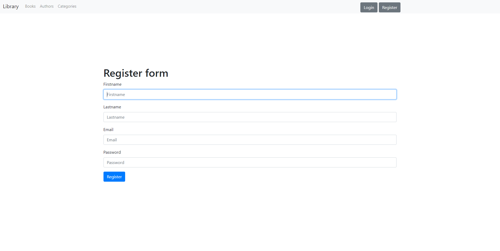
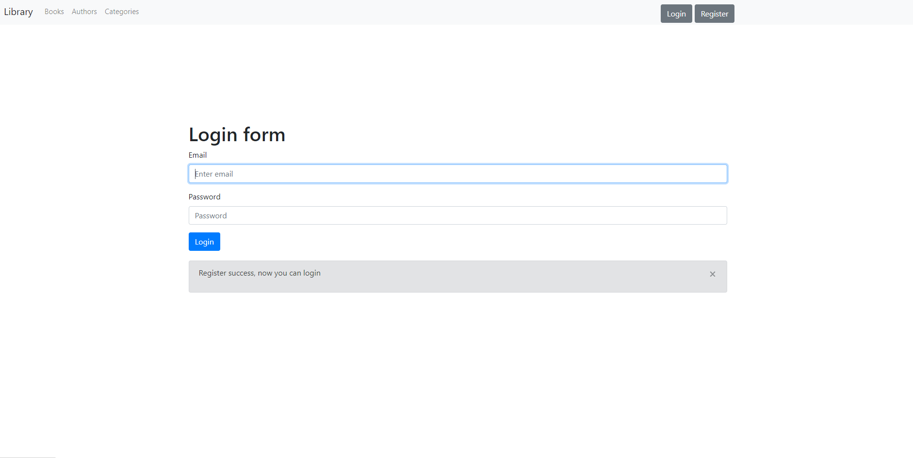

**Login form**
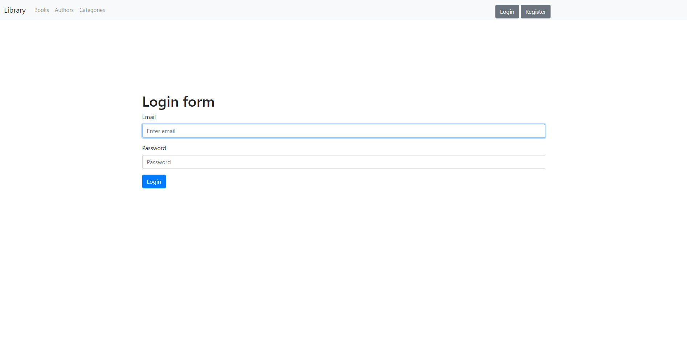
**Login form incorrect**
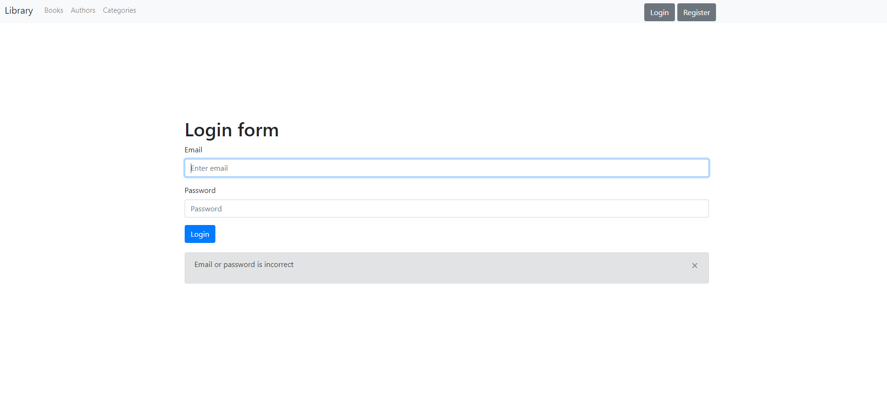

**There are three types of users who have different views and functionalities:**
1. Not loggin in - only read
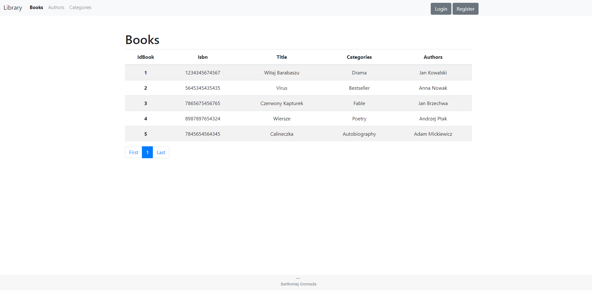

2. Logged ROLE_USER - only read, view with login
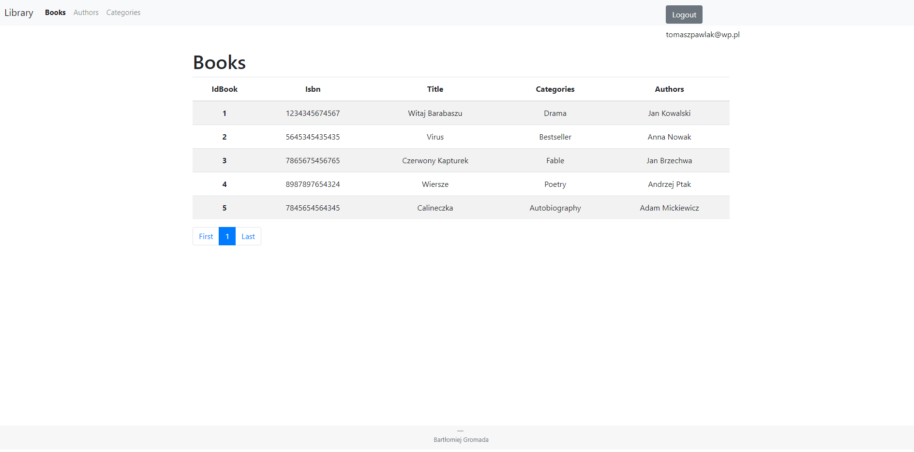

3. Logged ROLE_ADMIN - CRUD
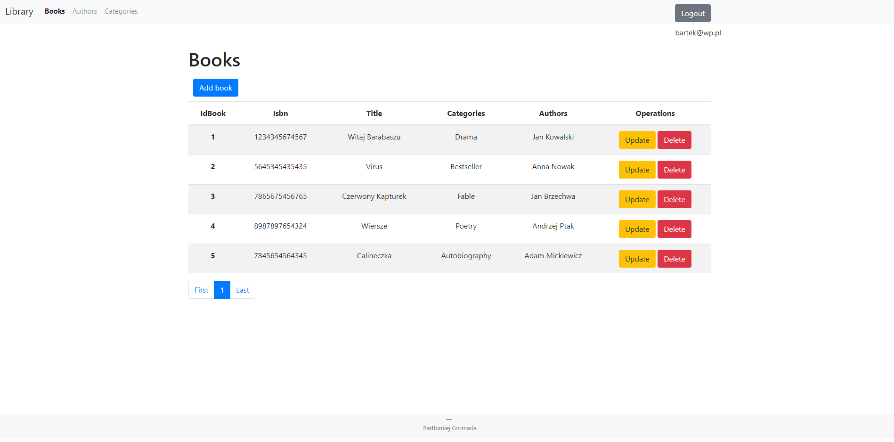

**CRUD on the example of books**
  * add
  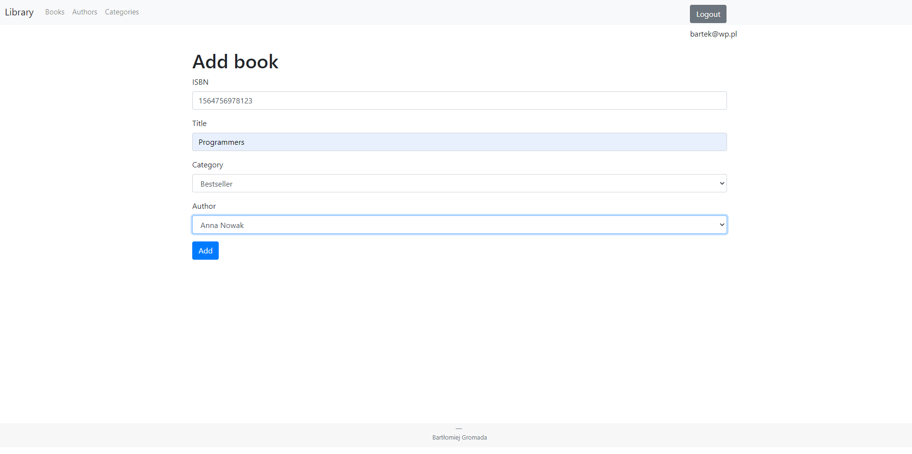
  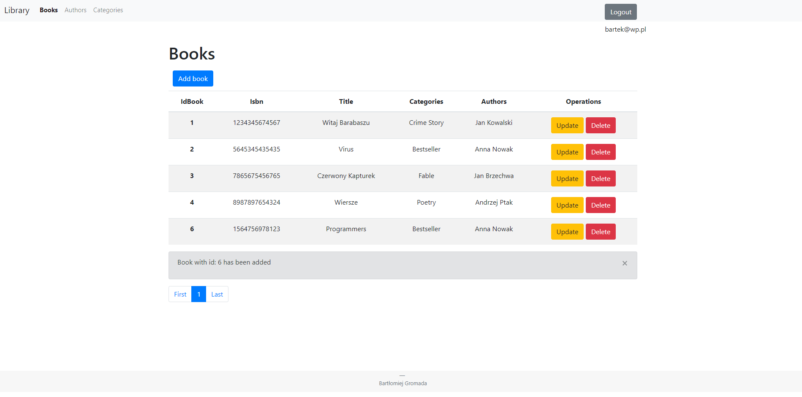
  * update
  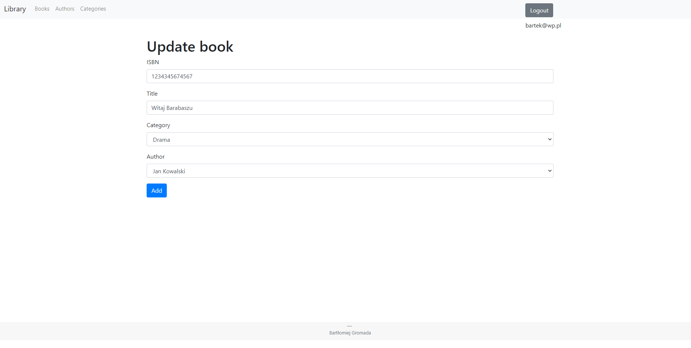
  
  * delete
  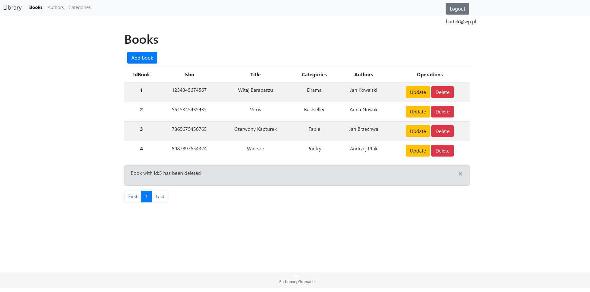
  
**Others tables:**
  * Categories
  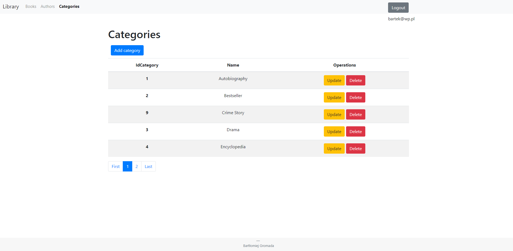
  * Authors
  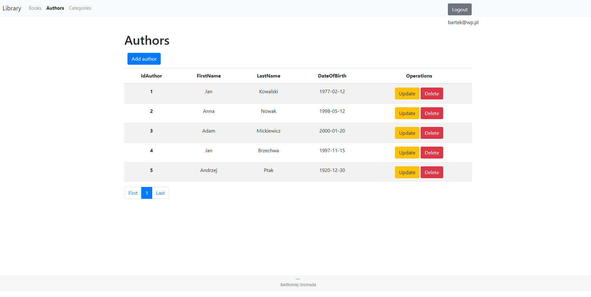
  
**System display this view when user want use operation for Admin**
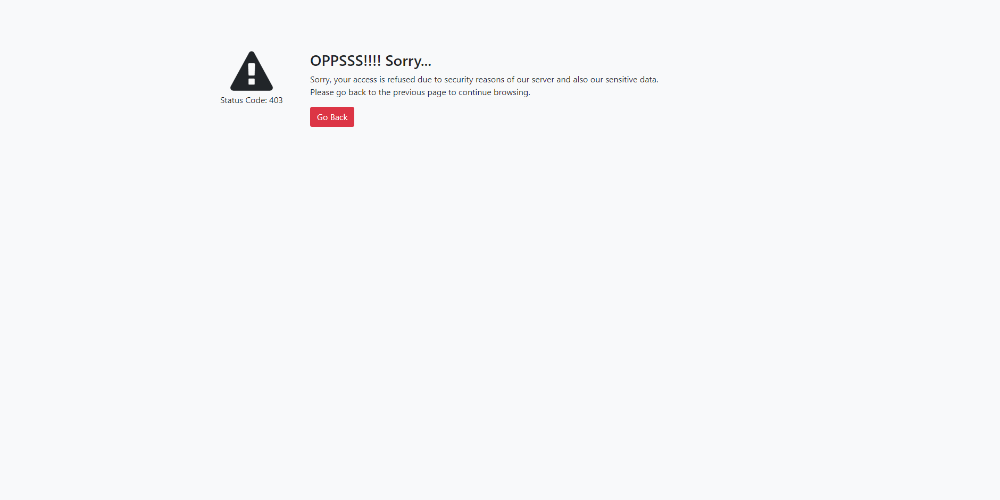
  
